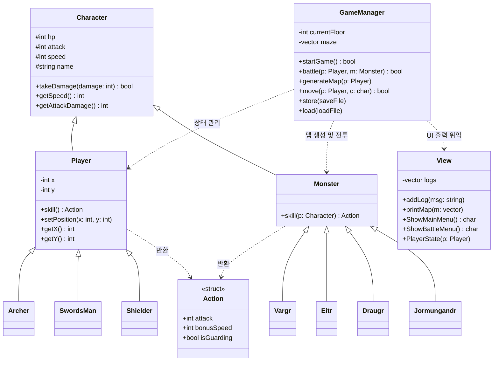

# 👣 MIRO-RPG-GAME
> 오직 CMD 창에서 진행되는 C++ 2D 미로 탐험 RPG 게임입니다.

<br/>

## 📖 프로젝트 요약 및 특징 (Introduction)
이 프로젝트는 C++로 구현된 콘솔 기반 2D 미로 탐험 RPG 게임입니다. 플레이어는 무작위로 생성되는 미로를 탐험하며 몬스터와 전투를 벌이고, 최종 보스인 요르문간드를 제압해 탑의 5층을 탈출해야 합니다.

단순한 기능 구현을 넘어, 객체지향 설계(OOP)와 모던 C++의 기능들을 적용하여 코드의 안정성을 높인 결과물입니다. 초기의 방대한 `GameManager` 시스템에서 콘솔 UI 및 렌더링 로직을 전담하는 `View` 클래스를 독립시켜 단일 책임 원칙(SRP)을 준수했습니다. 또한, `std::unique_ptr`를 활용한 스마트 포인터를 전면 도입하여 수동 메모리 할당으로 인한 누수 위험을 원천 차단했습니다.

기술적으로는 `std::stack`을 활용한 깊이 우선 탐색(DFS) 기반 알고리즘으로 매 층마다 새로운 미로를 생성합니다. 플레이 상태 저장을 위해서는 파일 스트림을 이용한 데이터 직렬화 및 역직렬화 로직을 구축했으며, 화면 갱신 시에는 ANSI 탈출 코드를 적용하여 콘솔 화면 렌더링을 최적화했습니다.

- **개발 인원:** 1인 개발
- **개발 기간:** 2026.07.21 ~ 2026.08.14
- **개발 언어:** C++ (C++14 이상 권장)

<br/>

## ✨ 주요 기능 (Key Features)
1. **맵 이동:** W, A, S, D 키를 이용한 2차원 배열 기반의 맵 이동 로직
2. **미로 생성:** DFS 백트래킹 알고리즘을 통한 무작위 미로 생성 시스템
3. **전투 시스템:** 몬스터 조우 시 발생하는 턴제 기반 전투 및 직업별 고유 스킬 시스템
4. **저장/불러오기:** 파일 입출력을 통한 플레이 데이터(HP, 위치, 맵 등) 직렬화 저장 기능

<br/>

## 🏗️ 클래스 아키텍처


## ⚔️ 직업 도감 (Classes)

플레이어는 게임 시작 시 3가지 직업 중 하나를 선택할 수 있습니다. 직업마다 특화된 스탯과 고유 스킬이 존재하여 다양한 전투 전략을 구사할 수 있습니다.

**1. 검사 (SwordsMan)**

* **특징:** 공수 밸런스가 가장 잘 잡혀있는 정통 전사 클래스입니다. (HP: 100 / 공격력: 24 / 스피드: 20)
* **고유 스킬 [익스큐션]:** 자신의 **기본 공격력을 1.5배 증폭**시켜 적에게 강력한 한 방 대미지를 꽂아 넣습니다. 무난하고 안정적인 딜링이 필요할 때 매우 효과적입니다.

**2. 궁수 (Archer)**

* **특징:** 체력은 낮지만 압도적인 스피드와 높은 기본 공격력을 가진 글래스 캐논(Glass Cannon) 클래스입니다. (HP: 70 / 공격력: 30 / 스피드: 30)
* **고유 스킬 [데스 스팅]:** 스킬 사용 시 일시적으로 **보너스 스피드를 무한대(9999)로 끌어올려 무조건 적보다 먼저 선공**을 잡습니다. 동시에 공격력도 1.2배 상승하여, 적에게 맞기 전에 적을 먼저 암살하는 극단적인 스피드 전투에 특화되어 있습니다.

**3. 방패병 (Shielder)**

* **특징:** 묵직한 체력으로 적의 공격을 버텨내는 탱커 클래스입니다. 스피드와 공격력은 낮지만 생존력이 압도적입니다. (HP: 140 / 공격력: 16 / 스피드: 10)
* **고유 스킬 [이지스의 가호]:** 스킬 사용 턴에 **상대 몬스터의 공격 대미지를 완전히 무효화(방어)하면서 동시에 자신의 기본 공격 대미지를 입히는** 공방일체의 스킬입니다. 강한 공격을 몰아치는 보스나 난적을 상대로 끈질기게 버티며 딜을 누적시킬 수 있습니다.

## 🐉 몬스터 도감 (Monsters)

탑을 오를수록 다양한 기믹을 가진 몬스터들이 등장합니다. 몬스터의 고유 스킬 패턴을 파악해야 생존할 수 있습니다.

**1. Vargr (바르그)**

* **특징:** 민첩성이 매우 뛰어난 야수형 몬스터입니다.
* **스킬 기믹:** 플레이어와 자신의 스피드를 비교하여, **자신이 더 빠를 경우 그 속도 차이만큼 추가 고정 피해**를 입힙니다. 스피드가 낮은 방패병(Shielder) 플레이어에게 특히 치명적입니다.

**2. Eitr (에이트르)**

* **특징:** 기괴한 속성을 가진 변칙적인 몬스터입니다.
* **스킬 기믹 (자폭):** **자신의 현재 체력에 비례한 추가 피해**를 입히지만, 스킬을 사용한 직후 **자신의 체력도 30% 깎이는** 자해성 공격을 합니다.

**3. Draugr (드로우그)**

* **특징:** 맷집이 강한 언데드 전사 몬스터입니다.
* **스킬 기믹 (광전사):** **자신이 잃은 체력의 절반만큼 대미지가 추가**로 증가합니다. 어설프게 체력을 남겨두었다간 다음 턴에 뼈아픈 일격을 맞을 수 있어 확실한 마무리가 필요합니다.

**4. Jormungandr (요르문간드) - 👑 5층 최종 보스**

* **특징:** 탑의 꼭대기 5층에서만 조우할 수 있는 최종 보스입니다. 기본 체력(120)과 공격력(30)이 압도적으로 높습니다.
* **스킬 기믹:**
* **강타:** 공격력의 1.5배에 달하는 묵직한 스킬 공격을 가합니다.
* **광폭화 (히든 기믹):** 전투가 **3턴 지속될 때마다 보스의 기본 공격력이 영구적으로 20%씩 상승**합니다. 전투가 길어질수록 막을 수 없는 대미지가 들어오므로, 스킬 자원을 아끼지 않고 속전속결로 쓰러뜨려야 합니다.


## 💻 실행 방법 (How to Run)

이 게임을 로컬 환경에서 실행하는 방법입니다.

```bash
# 1. 저장소 클론
$ git clone [https://github.com/V1dar2r/MIRO-RPG-GAME.git](https://github.com/V1dar2r/MIRO-RPG-GAME.git)

# 2. 디렉토리 이동
$ cd src

# 3. 컴파일 및 실행 (g++ 사용)
$ $ g++ *.cpp -o game.exe
$ ./game.exe

```

## 🐛 트러블슈팅 (Troubleshooting)

### 1. 상속 구조에서의 멤버 변수 섀도잉(Shadowing) 버그 해결

* **문제 상황:** 게임을 새로 시작하거나 세이브 파일을 불러올 때, 캐릭터의 체력이 수십만으로 비정상적으로 증가하는 현상이 발생했습니다.
* **원인:** 부모 클래스인 `Character`와 이를 상속받은 자식 클래스(`Player`, `Monster`) 양쪽에 `hp`, `attack`, `speed` 변수를 중복 선언하여, 자식 객체의 변수가 부모의 변수를 가려버리는 섀도잉(Shadowing) 문제가 원인이었습니다.
* **해결 및 성과:** 자식 클래스에 중복 선언된 멤버 변수를 모두 제거하고, 부모 클래스의 변수를 `protected`로 선언하여 안전하고 일관되게 상태를 공유하도록 수정했습니다. 상속 구조에서 데이터가 메모리에 어떻게 적재되는지 깊이 이해하는 계기가 되었습니다.

### 2. 직렬화(Serialization) 순서 불일치로 인한 세이브/로드 버그 수정

* **문제 상황:** 저장된 게임을 불러오면 맵 데이터가 깨지고 콘솔 창에 제어 문자가 출력되며 게임이 멈추는 버그가 있었습니다.
* **원인:** 파일에 데이터를 저장할 때(직렬화)의 순서와 불러올 때(역직렬화)의 데이터 매핑 순서가 일치하지 않아, 캐릭터의 스탯 숫자가 맵 데이터로 잘못 대입되고 있었습니다.
* **해결 및 성과:** 저장 및 불러오기 함수의 I/O 데이터 포맷을 1:1로 정확히 일치시켰습니다. 또한, 저장된 직업 문자열에 맞춰 객체를 동적 할당한 후 스탯을 복원하도록 설계하여 안전한 세이브/로드 시스템을 구축했습니다.

### 3. `_getch()` 확장 키 버퍼 이해 및 입력 지연 해결

* **문제 상황:** 방향키를 누를 때마다 "입력이 잘못되었습니다"라는 경고 메시지가 한 번 출력된 후, 다음 턴에서야 캐릭터가 움직이는 입력 지연 현상이 발생했습니다.
* **원인:** 방향키는 2바이트 확장 키로, `_getch()` 호출 시 첫 번째로 접두사 신호(224)를 반환하고 두 번째로 실제 방향 코드를 반환합니다. 첫 신호가 `switch` 문의 `default`로 빠지면서 발생한 예외였습니다.
* **해결 및 성과:** 입력 로직에 `if (c == 224 || c == 0) c = _getch();` 구문을 추가하여, 확장 키 신호 감지 시 즉시 버퍼에서 다음 실제 키 코드를 꺼내오도록 처리하여 매끄러운 조작감을 구현했습니다.

### 4. 렌더링 최적화: `system("cls")` 이슈 해결 및 ANSI Escape Code 도입

* **문제 상황:** 화면을 갱신할 때 `system("cls")`를 사용했으나, 외부 프로세스 호출로 인한 오버헤드, 심한 화면 깜빡임, 키 버퍼 간섭 등의 한계점이 발생했습니다.
* **해결 및 성과:** OS에 종속적인 외부 명령어 대신, C++ 표준과 터미널에서 지원하는 ANSI 탈출 코드(`\033[2J\033[1;1H`)로 렌더링 방식을 교체했습니다. 화면 지움 코드를 루프 상단으로 배치해 메시지 증발을 막고 부드러운 화면 전환을 이뤄냈습니다.

### 5. DFS 미로 생성 알고리즘의 런타임 크래시 방어

* **문제 상황:** 백트래킹(DFS) 기반의 무작위 미로 생성 중 프로그램이 간헐적으로 강제 종료(Crash)되는 현상이 있었습니다.
* **원인:** 스택의 이중 `pop()`으로 인한 언더플로우, 빈 컨테이너에서의 난수 범위 지정 에러, 오타로 인한 잘못된 좌표 참조 등 엣지 케이스(Edge Case) 처리가 미흡했습니다.
* **해결 및 성과:** 컨테이너가 비어있는지 확인하는 `if (!container.empty())` 검사 등 방어적 프로그래밍(Defensive Programming) 로직을 꼼꼼히 추가하고, 인덱스 기반 방향 오프셋 추출을 적용하여 복잡한 알고리즘의 메모리 안정성을 확보했습니다.

### 6. 선언과 구현의 분리 (.h / .cpp)를 통한 빌드 최적화

* **문제 상황:** 초기에는 헤더 파일(`.h`)에 클래스의 모든 구현부가 포함되어 있어, 코드가 길어질수록 컴파일 속도가 현저히 느려지고 다중 정의(ODR 위반) 에러 위험이 존재했습니다.
* **해결 및 성과:** 클래스의 명세(선언)는 헤더 파일에, 구체적인 동작 로직(구현)은 소스 파일(`.cpp`)로 철저히 분리했습니다. 이를 통해 링킹 구조를 정돈하고 코드 가독성 및 빌드 속도를 크게 향상시켰습니다.

### 7. 단일 책임 원칙(SRP) 준수 및 `View` 클래스 독립

* **문제 상황:** `GameManager` 클래스가 맵 생성, 전투, 키보드 입력, 화면 출력까지 모두 담당하는 거대한 객체(God Class)가 되어 유지보수가 매우 어려웠습니다.
* **해결 및 성과:** 콘솔 UI와 화면 출력만을 전담하는 `View` 클래스를 새롭게 독립시켰습니다. `GameManager`는 순수 게임 상태(Model) 제어에만 집중하게 함으로써 결합도를 낮추고 객체 지향의 핵심인 단일 책임 원칙(SRP)을 성공적으로 적용했습니다.

### 8. 모던 C++ 스마트 포인터 도입으로 메모리 누수 차단

* **문제 상황:** 원시 포인터(`*`)와 `new/delete`를 수동으로 관리하다 보니, 게임 종료나 예외 발생 구간에서 `delete`가 누락되어 메모리 누수(Memory Leak)가 발생할 위험이 있었습니다.
* **해결 및 성과:** C++11의 스마트 포인터(`std::unique_ptr`)와 `std::make_unique`를 전면 도입했습니다. RAII(Resource Acquisition Is Initialization) 패턴을 통해 객체가 스코프를 벗어나면 자동으로 메모리가 해제되도록 설계하여 수동 메모리 관리의 위험성을 원천 차단했습니다.


<br/>


## 프로젝트를 마친 소감 및 향후 계획

프로젝트를 시작하기 전, 진로를 정하고자 한창 열을 올리다가 결국 아무것도 하기 싫어졌던 무기력한 시기가 있었다. 남들과 비교하며 내 실력에 대한 강한 의문을 품기도 했다. '내가 과연 이 직업을 가질 수 있을까' 하는 고민이 깊어질 때쯤 2주 정도 국내 여행을 다녀왔고, 그 과정에서 당장의 조급함은 그리 중요하지 않다는 것을 깨달았다. 다시 처음부터 차근차근 시작해 보자는 마음으로, 매일 정해진 분량만큼 코딩 문제를 풀고 이 미로 탐험 프로젝트를 진행하며 하루하루를 채워나갔다.

프로젝트가 마무리되는 지금, 무엇이든 힘들어도 결국 해낼 수 있다는 자신감을 얻었다. 동시에, 과거의 나에게는 스스로 문제를 깊이 파고들어 찾아보는 노력이 턱없이 부족했음도 뼈저리게 알게 되었다. 이번 개발 과정에서 모르는 것을 끊임없이 검색하고, 코드를 어떻게 최적화할지 치열하게 고민했던 시간들은 나에게 무척 인상적인 경험으로 남았다. 이미 알고 있다고 착각했던 개념들도 막상 직접 구현해 보려니 한참 부족하다는 것을 느꼈고, 앞으로 더욱 겸손하게, 열심히 공부해야겠다고 다짐했다.

이 프로젝트를 앞으로 더욱 발전시키고 싶은 마음이 크기에, 틈틈이 꾸준히 코드를 개선해 나갈 계획이다. 특히 화면에 보이는 부분보다는, 보이지 않는 곳에서 로직을 설계하고 데이터를 주고받는 백엔드의 동작 원리에 더 큰 흥미를 느낀다는 것을 알게 되었다. 이를 바탕으로 향후에는 백엔드를 깊이 공부하며 AI API를 응용하는 엔지니어로 성장하고 싶다. 이 미로 RPG 게임과 연동하여 '인공지능 NPC'를 도입하는 추가 기능도 구상 중이다. 처음 입학했을 때 막연히 백엔드 개발자를 꿈꾸었던 것에 비하면 꽤 길을 돌아온 것 같기도 하다. 앞으로 또 목표가 바뀔지도 모르지만, 더 이상 조급한 마음은 갖지 않으려 한다. 1년 뒤의 내가 지금의 나를 돌아봤을 때 부끄럽지 않도록, 묵묵히 내 앞의 길을 걸어갈 것이다.

