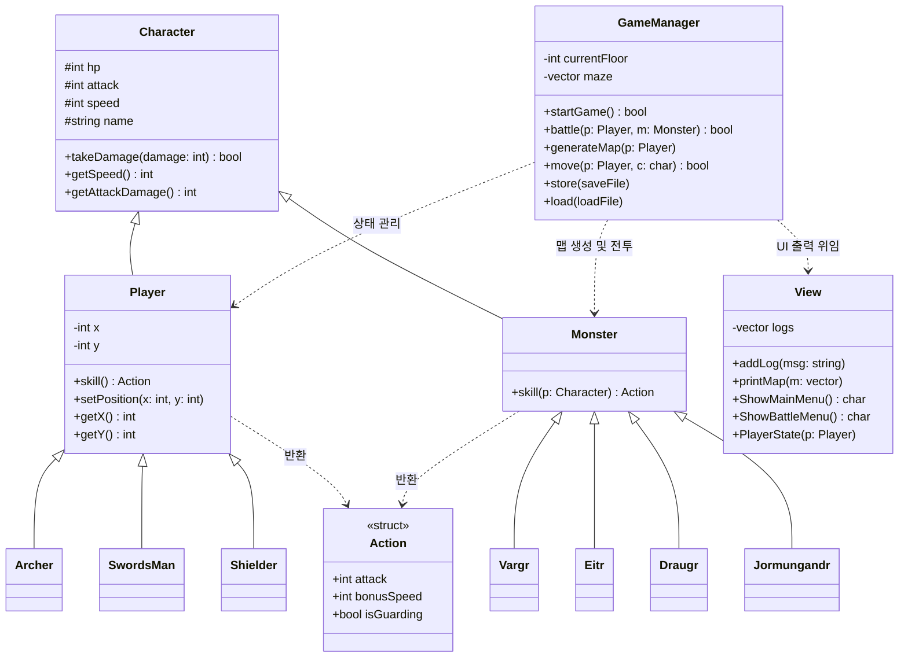

# 👣 MIRO-RPG-GAME
> 오직 CMD 창에서 진행되는 C++ 2D 미로 탐험 RPG 게임입니다.

<br/>

## 📖 프로젝트 요약 및 특징 (Introduction)
이 프로젝트는 C++로 구현된 콘솔 기반 2D 미로 탐험 RPG 게임입니다. 플레이어는 무작위로 생성되는 미로를 탐험하며 몬스터와 전투를 벌이고, 최종 보스인 요르문간드를 제압해 탑의 5층을 탈출해야 합니다.

단순한 기능 구현을 넘어, 객체지향 설계(OOP)와 모던 C++의 기능들을 적용하여 코드의 안정성을 높인 결과물입니다. 초기의 방대한 `GameManager` 시스템에서 콘솔 UI 및 렌더링 로직을 전담하는 `View` 클래스를 독립시켜 단일 책임 원칙(SRP)을 준수했습니다. 또한, `std::unique_ptr`를 활용한 스마트 포인터를 전면 도입하여 수동 메모리 할당으로 인한 누수 위험을 원천 차단했습니다.

기술적으로는 `std::stack`을 활용한 깊이 우선 탐색(DFS) 기반 알고리즘으로 매 층마다 새로운 미로를 생성합니다. 플레이 상태 저장을 위해서는 파일 스트림을 이용한 데이터 직렬화 및 역직렬화 로직을 구축했으며, 화면 갱신 시에는 ANSI 탈출 코드를 적용하여 콘솔 화면 렌더링을 최적화했습니다.

- **개발 인원:** 1인 개발
- **개발 기간:** 2026.07.21 ~ 2026.08.14
- **개발 언어:** C++ (C++14 이상 권장)

<br/>

## ✨ 주요 기능 (Key Features)
1. **맵 이동:** W, A, S, D 키를 이용한 2차원 배열 기반의 맵 이동 로직
2. **미로 생성:** DFS 백트래킹 알고리즘을 통한 무작위 미로 생성 시스템
3. **전투 시스템:** 몬스터 조우 시 발생하는 턴제 기반 전투 및 직업별 고유 스킬 시스템
4. **저장/불러오기:** 파일 입출력을 통한 플레이 데이터(HP, 위치, 맵 등) 직렬화 저장 기능

<br/>

## 🏗️ 클래스 아키텍처


## ⚔️ 직업 도감 (Classes)

플레이어는 게임 시작 시 3가지 직업 중 하나를 선택할 수 있습니다. 직업마다 특화된 스탯과 고유 스킬이 존재하여 다양한 전투 전략을 구사할 수 있습니다.

**1. 검사 (SwordsMan)**

* **특징:** 공수 밸런스가 가장 잘 잡혀있는 정통 전사 클래스입니다. (HP: 100 / 공격력: 24 / 스피드: 20)
* **고유 스킬 [익스큐션]:** 자신의 **기본 공격력을 1.5배 증폭**시켜 적에게 강력한 한 방 대미지를 꽂아 넣습니다.

**2. 궁수 (Archer)**

* **특징:** 체력은 낮지만 압도적인 스피드와 높은 기본 공격력을 가진 글래스 캐논(Glass Cannon) 클래스입니다. (HP: 70 / 공격력: 30 / 스피드: 30)
* **고유 스킬 [데스 스팅]:** 스킬 사용 시 일시적으로 **보너스 스피드를 무한대(9999)로 끌어올려 무조건 적보다 먼저 선공**을 잡습니다. 동시에 공격력도 1.2배 상승합니다.

**3. 방패병 (Shielder)**

* **특징:** 묵직한 체력으로 적의 공격을 버텨내는 탱커 클래스입니다. (HP: 140 / 공격력: 16 / 스피드: 10)
* **고유 스킬 [이지스의 가호]:** 스킬 사용 턴에 **상대 몬스터의 공격 대미지를 완전히 무효화(방어)하면서 동시에 자신의 기본 공격 대미지를 입히는** 공방일체의 스킬입니다.

## 🐉 몬스터 도감 (Monsters)

탑을 오를수록 다양한 기믹을 가진 몬스터들이 등장합니다.

* **Vargr (바르그):** 플레이어와 자신의 스피드를 비교하여, **자신이 더 빠를 경우 그 속도 차이만큼 추가 고정 피해**를 입힙니다.
* **Eitr (에이트르):** **자신의 현재 체력에 비례한 추가 피해**를 입히지만, 스킬을 사용한 직후 **자신의 체력도 30% 깎이는** 자해성 공격을 합니다.
* **Draugr (드로우그):** **자신이 잃은 체력의 절반만큼 대미지가 추가**로 증가합니다.
* **Jormungandr (요르문간드 - 👑 5층 최종 보스):** 기본 체력(120)과 공격력(30)이 압도적으로 높으며, 전투가 **3턴 지속될 때마다 보스의 기본 공격력이 영구적으로 20%씩 상승**하는 광폭화 기믹을 가집니다.

## 💻 실행 방법 (How to Run)

이 게임을 로컬 환경에서 실행하는 방법입니다. 표준 C++ 라이브러리와 ANSI Escape Code를 사용하여 OS 종속성을 최소화했습니다.

```bash
# 1. 저장소 클론
$ git clone [https://github.com/V1dar2r/MIRO-RPG-GAME.git](https://github.com/V1dar2r/MIRO-RPG-GAME.git)

# 2. 디렉토리 이동
$ cd src

# 3. 컴파일 및 실행 (g++ 사용)
$ g++ *.cpp -o game.exe
$ ./game.exe

```

## 🧗‍♂️ 핵심 성장 경험 및 트러블슈팅 (Growth & Troubleshooting)

### 1. [기술/아키텍처] "돌아가는 코드"에서 "유지보수 가능한 코드"로의 한계 극복

* **상황 및 한계:** 처음에는 기능 구현에만 집중하다 보니 `GameManager` 클래스 하나에 맵 생성, 전투, 입출력, 화면 렌더링 등이 모두 몰리는 'God Class'가 되었습니다. 또한 모든 구현부가 헤더 파일(`.h`)에 들어가 있어 프로젝트 규모가 커질수록 빌드 속도가 느려지고, 기능 하나를 수정할 때마다 다른 곳에서 예기치 못한 버그가 연쇄적으로 터지는 유지보수의 한계에 직면했습니다.
* **해결 행동:** 클래스의 선언(`.h`)과 구현(`.cpp`)을 명확히 분리하여 링킹 구조를 정돈했습니다. 화면 출력과 로그 기록을 전담하는 `View` 클래스를 독립시켜 객체지향의 단일 책임 원칙(SRP)을 적용하고, `GameManager`는 순수 게임 흐름만 통제하도록 역할을 분리했습니다.
* **배운 점:** 무조건 기능을 빠르게 짜는 것보다, 역할과 책임을 명확히 나누는 초기 설계와 구조화가 장기적인 안정성과 유지보수성에 결정적인 영향을 미친다는 점을 깊이 체득했습니다.

### 2. [CS/메모리 관리] 포인터와 메모리 구조에 대한 이해 부족 극복

* **상황 및 한계:** 상속 구조에서 자식 클래스에 변수를 중복 선언해 체력이 수십만으로 오버플로우되거나(섀도잉 현상), 원시 포인터와 `delete`를 수동으로 다루는 과정에서 누락이 발생해 메모리 주소 참조 오류(Crash)를 겪었습니다. 기존에는 C++ 문법을 안다고 생각했지만, 실제 메모리 적재 원리와 포인터의 본질을 깊이 이해하지 못해 런타임 버그에 막히는 한계를 느꼈습니다.
* **해결 행동:** 단순히 오류 코드를 지우고 넘어가지 않고, C++의 메모리 영역(Stack, Heap)과 포인터 역참조 원리(`p`, `*p`, `&p`), 상속 시 부모/자식 메모리 배치 구조를 밑바닥부터 다시 분석했습니다. 나아가 C++11의 모던 C++ 기능인 스마트 포인터(`std::unique_ptr`, `std::make_unique`)를 전면 도입하여 수동 메모리 해제 없이도 RAII 패턴으로 안전하게 자원이 해제되도록 리팩토링했습니다.
* **배운 점:** 프로그래밍 언어의 문법을 표면적으로 사용하는 것을 넘어, 컴퓨터의 메모리 구조와 하부 동작 원리를 명확히 이해하고 코드를 작성해야 견고한 소프트웨어를 만들 수 있음을 깨달았습니다.

### 3. 직렬화(Serialization) 순서 불일치 이슈

* **이슈 및 해결:** 파일에 데이터를 저장할 때(직렬화)와 불러올 때(역직렬화)의 순서 불일치로 맵 데이터가 깨지는 현상을 발견했습니다. 이를 해결하기 위해 I/O 데이터 포맷을 1:1로 정확히 일치시키고, 직업 문자열에 맞춰 객체를 동적 할당하도록 세이브/로드 시스템을 안정화했습니다.

### 4. 렌더링 최적화 및 DFS 크래시 방어

* **이슈 및 해결:** `system("cls")` 호출로 인한 오버헤드와 깜빡임을 표준 ANSI 탈출 코드(`\033[2J\033[1;1H`)로 교체하여 렌더링을 최적화했습니다. 또한 DFS 백트래킹 미로 생성 중 스택 언더플로우를 막기 위해 `if (!container.empty())` 등의 방어적 프로그래밍 로직을 적용하여 런타임 크래시를 차단했습니다.

## 💡 프로젝트 회고 및 향후 개선점 (Retrospective)

이번 미로 탐험 RPG 프로젝트는 단순한 구현을 넘어 '객체지향적인 아키텍처 설계'와 '메모리 안전성'을 실전에서 치열하게 고민해 본 뜻깊은 경험이었습니다. 하지만 프로젝트를 완성하고 리뷰하면서 현재 아키텍처가 가진 기술적 한계점들 역시 명확히 인지하게 되었습니다.

1. **데이터 하드코딩의 한계:** 현재 직업과 몬스터의 스탯 정보가 코드 내부에 하드코딩되어 있어 기획 변경에 취약합니다. 외부 데이터(JSON, CSV)를 읽어와 초기화하는 '데이터 주도 설계(Data-Driven Design)'의 필요성을 느꼈습니다.
2. **다형성(Polymorphism) 활용 부족:** 상위 클래스를 순수 가상 함수를 포함한 추상 클래스(Abstract Class)로 설계하지 못했고, 객체 생성 시 팩토리 패턴(Factory Pattern) 대신 분기문을 사용해 다형성의 이점을 100% 살리지 못했습니다.
3. **예외 처리의 부재:** 세이브/로드 기능 구현 시 방어적 프로그래밍을 적용했다고 명시했으나, 실제 파일 입출력 시에는 is_open()으로 단순히 파일 존재 여부만 검사할 뿐, 데이터 손상이나 타입 불일치에 대한 try-catch 기반의 예외 처리는 부족했습니다.

### 🚀 Next Step: Backend (Java/Spring Boot)

이러한 한계점들을 분석하며, 화면에 보여지는 요소보다는 **보이지 않는 곳에서 데이터를 안전하게 저장하고, 객체 간의 관계를 설계하며, 효율적인 비즈니스 로직을 구축하는 '백엔드 아키텍처' 영역에 제가 훨씬 더 큰 흥미를 느낀다는 것**을 깨달았습니다.

따라서 이 C++ 프로젝트를 통해 다진 CS 기본기와 메모리 구조에 대한 이해도를 바탕으로, 본격적인 서버/백엔드 생태계(Java & Spring Boot)로 기술 스택을 확장하고자 합니다. 이 프로젝트를 밑거름 삼아 다음 단계에서는 관계형 데이터베이스(RDBMS) 설계와 API 통신을 다루는 튼튼한 백엔드 엔지니어로 성장하겠습니다.
